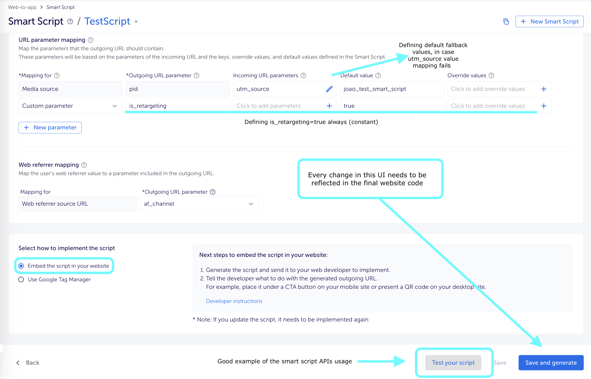
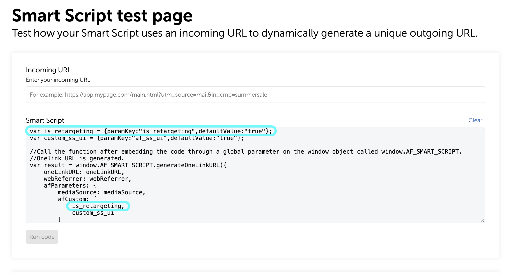
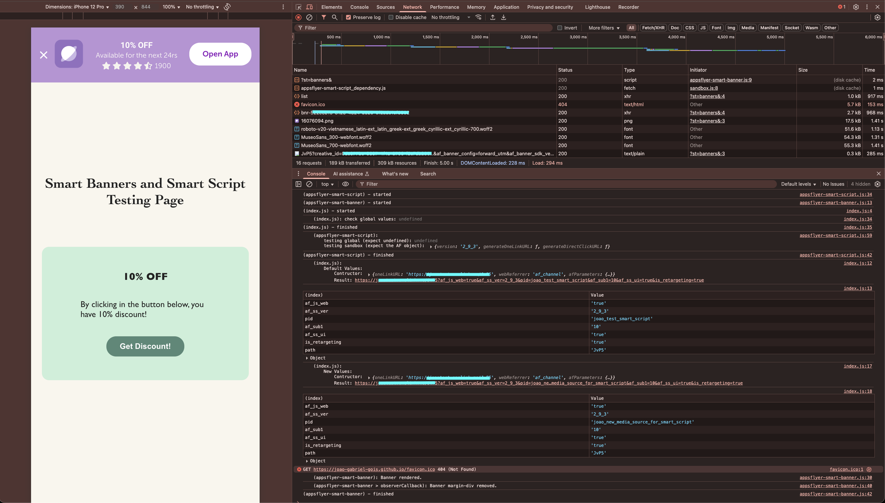

<sub><a href="doc/README_PT-BR.md">Switch to Portuguese version</a></sub>

# Basic Integration Example for AppsFlyer's Smart Banners and Scripts
Without modifying any part of the code snippets provided by AppsFlyer, this example aims to control when they are called and how much they impact global variables and properties of the page. Here you can find a general recommendations for integrating Smart Scripts (1), followed by details of this specific implementation (2).
## 1. General recommendations for integrating Smart Scripts (after copying the code from AppsFlyer)
### Use defaults as fallbacks for mapped parameters or to define constants


### Always remember that every update must also be made in the website code


### After integrating for the first time, change only the parameter logic (“Test your script” button)
Note that the latest call is stored in a variable called `result`. The missing code for the complete integration needs to be added based on it. 
```js
// Minified AppsFlyer integration code (incomplete example, illustrative only)
function _arrayLikeToArray(t,e){(null==e||e>t.length)&&(e=t.length);for(var o=0,r=Array(e);o<e;o++)r[o]=t[o];return r} // ... to be continued...
// Defining the constructor for the method that creates the OneLink URL, the parameter values are based on the UI setup
var fakeSubdomain = "yoursubdomain"; // Fake subdomain as example
var fakeTemplateID = "KwT4"; // Fake id as example
var oneLinkURL = "https://" + fakeSubdomain + ".onelink.me/" + fakeTemplateID;
var webReferrer = "af_channel";
var mediaSource = {keys:["utm_source"],defaultValue:"joao_test_smart_script"};
var is_retargeting = {paramKey:"is_retargeting",defaultValue:"true"};
var custom_ss_ui = {paramKey:"af_ss_ui",defaultValue:"true"};
// The OneLink URL is inside 'result'; it still needs to be consumed
var result = window.AF_SMART_SCRIPT.generateOneLinkURL({
    oneLinkURL: oneLinkURL,
    webReferrer: webReferrer,
    afParameters: {
        mediaSource: mediaSource,
        afCustom: [ is_retargeting, custom_ss_ui],
    }
});
```
### After copying AppsFlyer’s code, you must bind it to a button or link
There are several ways to do this. The examples below cover a few cases. The key point is selecting the element correctly and getting the URL from `result.clickURL`.

Examples:
1. With a button using an event listener (insert right after copying AppsFlyer’s code):
    ```js
    const button = document.querySelector("#CTA-button-id"); // Select the button using any CSS selector
    button.addEventListener('click', () => {
        const a = document.createElement('a');
        a.href = result.clickURL;
        a.click();
    }) 
    ```
2. With a link:
    ```js
    const a = document.querySelector("#CTA-link-id"); // Select the link using any CSS selector
    a.href = result.clickURL;
    ```
___

## 2. Comments on this implementation (code in the repo):
This simple page implements both Smart Banners and Smart Scripts. Below, you’ll find some comments on the choices made.

- **Smart Banners** aren’t easily sandboxed. They depend on network requests and on the data populated in `window.AF` by the AppsFlyer integration snippet. Accordingly, this implementation integrates them as-is and simply monitors for render completion to remove the spacer element the banner injects (which would otherwise push page content down), keeping the layout fixed.

- **Smart Scripts** are sandboxed: only the method required for this implementation (and its constructor) is accessible via import
    - The constructor (the configuration object used to initialize the script) can be modified within the importing module’s scope. This behavior is demonstrated on the excerpt of <a href="./index.js" target="_blank">index.js</a> below:
        ```js
        // (...)
        // Importing config object (constructorArgs) with default values
        const { constructorArgs, generateNewOneLinkURL } = await AFScript();

        const result = generateNewOneLinkURL();
        console.log('\n\nDefault Values.\nContructor:', constructorArgs, '\nResult:', result.clickURL);
        console.table(getVisualParams(result.clickURL));
        
        // Changing constructorArgs values below (the actual media source considered)
        constructorArgs.afParameters.mediaSource.defaultValue = 'joao_new_media_source_for_smart_script';
        const newResult = generateNewOneLinkURL();
        console.log('\n\nNew Values.\nContructor:', constructorArgs, '\nResult:', newResult.clickURL);
        console.table(getVisualParams(newResult.clickURL));
        // (...)
        ```
    - Yet, this is not the perfect scenario, if someone remove some of the parameters by, for example, wrongly overwritting it (e.g: `constructorArgs.afParameters.mediaSource = 'media_source_name'`), this can break the setup for generating the Onelink URL. Anyway, in a real project this is easily handled only by using TypeScript and encapsulation, preventing the constructor object from being exposed to any importing module. For this example purpose, I achieved what I wanted and called it a day.

- This is how the final implementation logs each step, in the <u><b><a href="https://joao-gabriel-gois.github.io/AF-smart-banner-n-script-test/" target="_blank">Final Page</a></b></u>:
    
