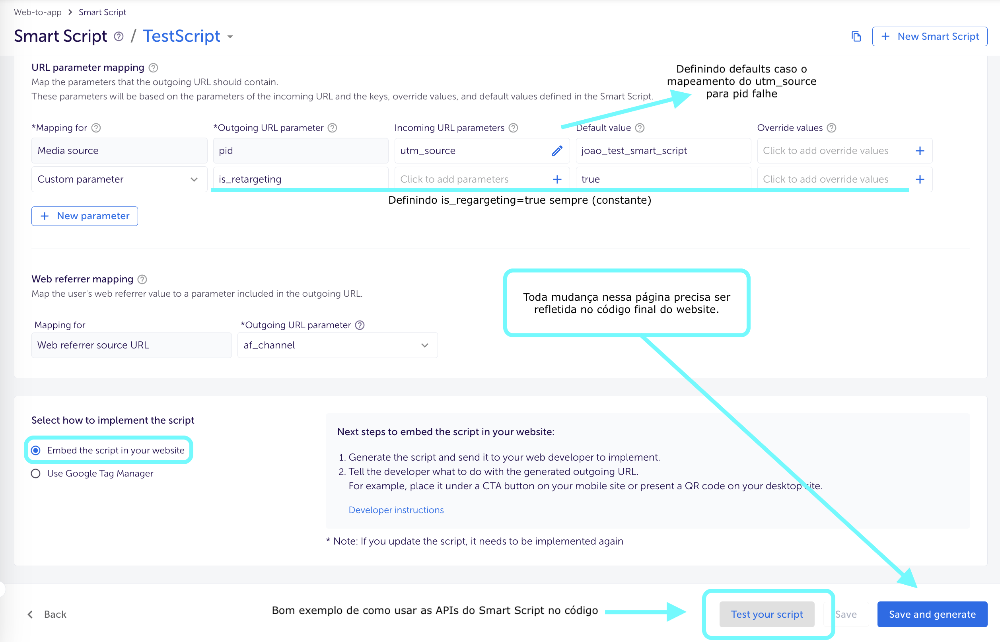

<sub><a href="../README.md">Ir para a versão em Inglês</a></sub>

# Exemplo Básico de Integração dos Smart Banners e Smart Scripts da AppsFlyer
Sem modificar os trechos de código fornecidos pela AppsFlyer, este exemplo busca controlar quando eles são chamados e quanto afetam as variáveis/propriedades globais da página. Aqui você encontra recomendações gerais para integrar Smart Scripts (1) e, em seguida, detalhes específicos desta implementação (2).
## 1. Recomendações gerais para integrar Smart Scripts (após copiar o código da AppsFlyer)
#### Use valores padrão (defaults) como fallback para parâmetros mapeados ou para definir constantes


#### Lembre-se: toda atualização feita na UI também precisa ser aplicada no código do site


#### Após a integração inicial, altere apenas a lógica de parâmetros (botão “Test your script”)
Note que a última chamada fica armazenada em uma variável chamada `result`. O código que falta para a integração completa precisa ser adicionado com base nele.
```js
// Código minificado de integração da AppsFlyer (exemplo INCOMPLETO, apenas ilustrativo)
function _arrayLikeToArray(t,e){(null==e||e>t.length)&&(e=t.length);for(var o=0,r=Array(e);o<e;o++)r[o]=t[o];return r} // ... e continua...
// Definindo o construtor para o método que cria a URL do Onelink, o valor dos parâmetros é baseado na configuração feita na UI
var fakeSubdomain = 'yoursubdomain'; // Exemplo com subdomínio falso
var fakeTemplateID = 'KwT4'; // Exemplo com template id falso
var oneLinkURL = "https://" + fakeSubdomain + ".onelink.me/" + fakeTemplateID;
var webReferrer = "af_channel";
var mediaSource = { keys: ["utm_source"], defaultValue: "joao_test_smart_script" };
var is_retargeting = { paramKey: "is_retargeting", defaultValue: "true" };
var custom_ss_ui = { paramKey: "af_ss_ui", defaultValue: "true" };
// A URL do OneLink está dentro de 'result'; ainda precisa ser consumida
var result = window.AF_SMART_SCRIPT.generateOneLinkURL({
  oneLinkURL: oneLinkURL,
  webReferrer: webReferrer,
  afParameters: {
    mediaSource: mediaSource,
    afCustom: [ is_retargeting, custom_ss_ui ],
  }
});
```

#### Depois de copiar o código da AppsFlyer, faça o bind em um botão ou link
Há várias formas de fazer isso. Os exemplos abaixo cobrem alguns casos. O importante é selecionar corretamente o elemento e recuperar a URL do Onlink da `result.clickURL`.

Exemplos:
1. Com um botão e um event listener (insira logo após o código da AppsFlyer):
    ```js
    const button = document.querySelector("#CTA-button-id"); // Selecione usando qualquer seletor CSS
    button.addEventListener("click", () => {
      const a = document.createElement("a");
      a.href = result.clickURL;
      a.click();
    });
    ```
2. Com um link:
    ```js
    const a = document.querySelector("#CTA-link-id"); // Selecione usando qualquer seletor CSS
    a.href = result.clickURL;
    ```
___

## 2. Comentários sobre esta implementação (código no repositório)
Esta página simples implementa tanto Smart Banners quanto Smart Scripts. Abaixo estão alguns comentários sobre escolhas feitas.

- **Smart Banners** não são facilmente isoláveis (evitando setup globais). Eles dependem de requisições de rede e dos dados populados em `window.AF` pelo snippet da AppsFlyer. Nesta implementação, eles são integrados como estão, o código apenas observa a confirmação da renderização do Banner, para remover o “spacer” que ele injeta (que empurraria o conteúdo da página), mantendo o layout estável.

- **Smart Scripts** foram isolados (sandbox): apenas o método necessário para esta implementação (e seu construtor) fica acessível via import.
    - O construtor (o objeto de configuração usado para inicializar o script) pode ser modificado dentro do escopo do módulo que o importa. Isso é demonstrado no trecho do <a href="./index.js" target="_blank">index.js</a> abaixo:
        ```js
        // (...)
        // Importando o objeto de configuração (constructorArgs) com valores padrão
        const { constructorArgs, generateNewOneLinkURL } = await AFScript();

        const result = generateNewOneLinkURL();
        console.log('\n\nDefault Values.\nContructor:', constructorArgs, '\nResult:', result.clickURL);
        console.table(getVisualParams(result.clickURL));
        
        // Alterando os valores de constructorArgs abaixo (a mídia source efetivamente considerada)
        constructorArgs.afParameters.mediaSource.defaultValue = 'joao_new_media_source_for_smart_script';
        const newResult = generateNewOneLinkURL();
        console.log('\n\nNew Values.\nContructor:', constructorArgs, '\nResult:', newResult.clickURL);
        console.table(getVisualParams(newResult.clickURL));
        // (...)
        ```
    - Isso não é à prova de erros: se alguém remover/sobrescrever parâmetros aninhados de forma incorreta (por exemplo, `constructorArgs.afParameters.mediaSource = 'media_source_name'`), a geração da URL do OneLink pode quebrar. Em um projeto real, isso é facilmente evitado com TypeScript e encapsulamento, evitando expor o objeto do construtor inteiro a qualquer módulo que o importe. Para o propósito desse exemplo, dei o objetivo por concluído.

- A implementação final com logs em cada etapa está na <u><b><a href="https://joao-gabriel-gois.github.io/AF-smart-banner-n-script-test/" target="_blank">Página Final</a></b></u>:
    

